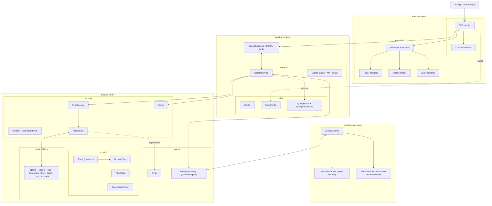
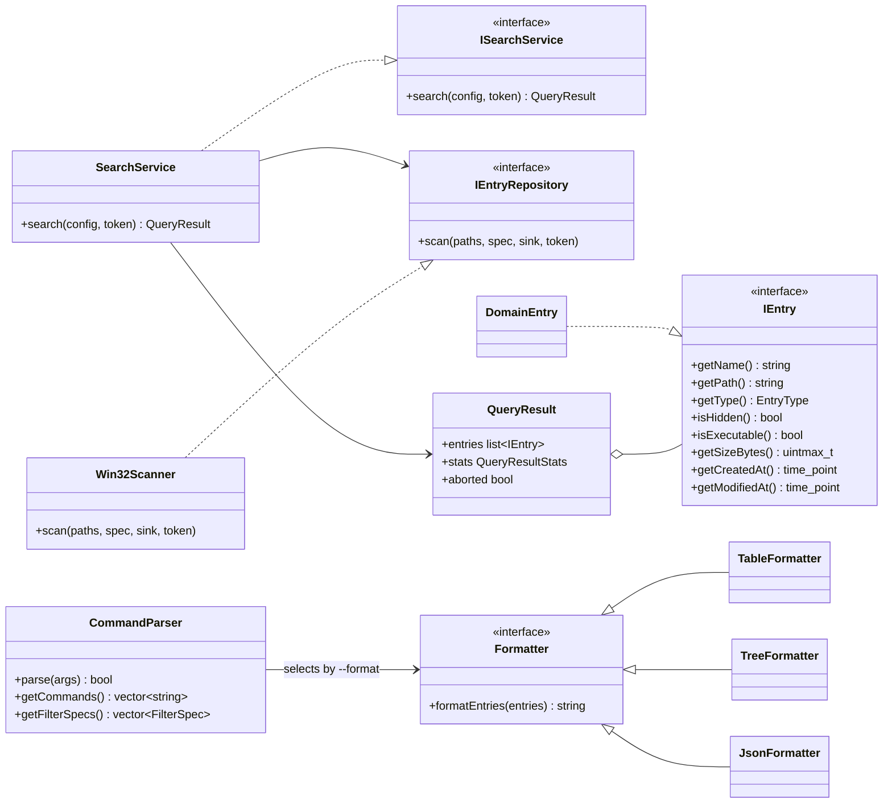
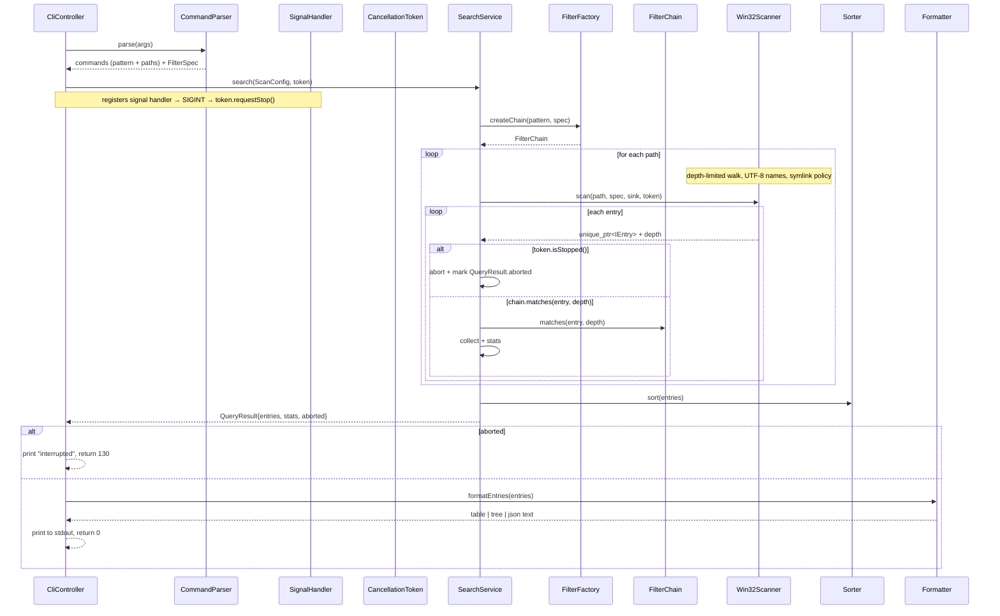

# sniff — Architecture

This document describes the current architecture of the `sniff` repo with Mermaid
diagrams. It is a snapshot of `main`; see `../design/DECISIONS.md` for the rationale
behind these shapes (layers, ports, cancellation, encoding, …).

## The four layers

```

| layer            | lives in          | job                                          | may depend on |
|------------------|-------------------|----------------------------------------------|---------------|
| interface        | src/interface/    | CLI parsing + output formatting              | application   |
| application      | src/application/  | use-case orchestration, DTOs, primary port   | domain        |
| domain           | src/domain/       | entry model, filters, matching, sorting      | nothing       |
| infrastructure   | src/infrastructure/ | concrete Win32 filesystem scanner          | domain        |
```

Dependencies point *inward*: nothing above `domain` is known to `domain`. CMake enforces
this: `interface_layer PRIVATE application_layer`, `application_layer PUBLIC
domain_layer`, `infrastructure_layer PUBLIC domain_layer`.

## Component diagram



### Read as data flow

`main` → `CliController` → (`CommandParser` for specs, `SignalHandler`+`CancellationToken`
for Ctrl+C) → `SearchService` → `FilterChain` **and** `Sorter` **and** `Win32Scanner` →
matched `IEntry`s → `TableFormatter`/`TreeFormatter`/`JsonFormatter` → stdout.

The two ports (`ISearchService` primary, `IEntryRepository` secondary) are the seams that
let tests substitute fakes for the real scanner/CLI.

## Key type relationships



## Search flow (a full run of `sniff <pattern> <path>`)



Errors that throw (missing root, malformed pattern/date/size) are caught by
`CliController`, printed to stderr, and exit with code `1`.

## Testing architecture

- GoogleTest suites in `tests/`, discovered via `gtest_discover_tests` (CTest).
- Unit tests drive `ISearchService` / `IEntryRepository` **fakes**; the scanner's pure
  core (`Win32ScanCore`) is fed synthetic `WIN32_FIND_DATA`.
- Integration tests build real temp-dir trees and run the whole
  `CliController → SearchService → Win32Scanner` pipeline, including real symlinks.
- See `src/infrastructure` for the scanner and `tests/CMakeLists.txt` for wiring.